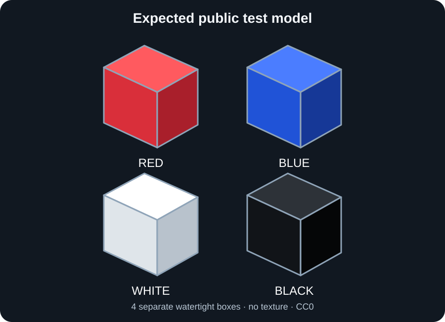

# ChromaMatter macOS alpha volunteer test guide

Thank you for helping test ChromaMatter on Mac. This page is the single
starting point for the separate **Apple Silicon / macOS 15+ alpha**. It does
not replace the stable Windows build or the Windows Flat Four Test 3
prerelease. The current development product version is `0.9`.

## Current availability

**Approved tester download: not available yet.** The Apple Silicon app now
passes the technical CI checks, but distribution remains blocked while
source/relink closure evidence is unresolved for 253 packaged Mach-O files. A
diagnostics artifact is not an application and cannot be launched. Do not use
an unreviewed ZIP sent through a comment, mirror, or file-sharing service.

When a build is approved, its exact workflow run, artifact name, source commit,
SHA-256, and expiry date will be posted in
[macOS Alpha Testing discussion #9](https://github.com/Ponkichi0718/ChromaMatter/discussions/9).
The approved artifact will be short-lived and may require a GitHub account to
download. If no approved build is listed there, please wait rather than testing
an older or unofficial copy.

Once a build is listed, the basic path is:

1. Download the exact approved artifact.
2. Verify its SHA-256.
3. Run the 10-minute checklist below with the supplied public test GLB.
4. Share a successful result in Discussions, or file a reproducible problem
   with the [macOS alpha Issue form](https://github.com/Ponkichi0718/ChromaMatter/issues/new?template=macos_alpha_report.yml).

## Who this build is for

You need:

- an Apple Silicon Mac (M1, M2, M3, M4, or later), not an Intel Mac;
- macOS 15 or newer;
- about 15 minutes for the basic test;
- permission to share your Mac specifications and sanitized screenshots/logs;
- Snapmaker Orca only for the optional 3MF-opening check.

No programming knowledge, printer, paid AI account, or private model is needed
for the required test. Please do not start with an important or complicated
model.

## Download the approved build

Use only the workflow run linked from macOS testing discussion #9. On the run
page, scroll to **Artifacts** and click the one approved artifact whose name
begins:

`ChromaMatter-macOS15-arm64-developer-id-unsigned-unnotarized-alpha-`

GitHub downloads one **outer artifact ZIP**. Extract that outer ZIP once. It
contains two files:

- the **inner application ZIP** beginning
  `ChromaMatter-0.9-r33-macos15-arm64-developer-id-unsigned-unnotarized-alpha`;
- the matching `.zip.sha256` checksum file.

Do **not** download the similarly named `diagnostics` artifact. It contains
test reports only, not the app. The approved post must identify the same source
commit as `SOURCE_COMMIT.txt` inside the tester package.

## Verify the download

In Terminal, type `shasum -a 256 ` (including the final space), drag the
downloaded inner application ZIP into the Terminal window, and press Return.
Compare the resulting 64 characters with the first 64 characters in the
supplied `.zip.sha256` file. They must be identical. Stop and report the
problem if they differ.

Extract the inner ZIP completely. Do not run the app from inside either ZIP.
Read `README_TESTING_EN.md` and `MACOS_ALPHA_COMPLIANCE_NOTICE_EN.txt` in the
extracted folder before opening the app.

## First launch on macOS

This volunteer alpha is ad-hoc signed, but it has no Apple Developer ID
signature and is not notarized. A first-launch warning is therefore expected.

1. In Finder, Control-click `ChromaMatter-macOS-Alpha.app` and choose **Open**.
2. Confirm **Open** in the warning dialog if macOS offers it.
3. If it is still blocked, open **System Settings > Privacy & Security** and
   approve this specific copy of ChromaMatter, then repeat step 1.
4. Do not disable Gatekeeper globally and do not use `sudo`.

Only after the SHA-256 has matched and those steps still fail, use:

```bash
xattr -dr com.apple.quarantine "/path/to/ChromaMatter-macOS-Alpha.app"
open "/path/to/ChromaMatter-macOS-Alpha.app"
```

A pass means the main window remains open for at least 30 seconds and its title
identifies the macOS alpha. A crash, blank window, or permanent beachball is a
failure worth reporting.

## 10-minute required test

The tester package includes
`ChromaMatter-Public-Four-Color-Test.glb`, a small CC0 model made only from four
watertight boxes. It uses exact red, blue, white, and black vertex colours. It
contains no brand, character, reference image, texture, network resource, or
private metadata.



The diagram is an orientation guide, not a colour-calibration target. Your
lighting and camera angle may differ, but all four blocks must remain separate
and recognisably red, blue, white, and black.

### Click-by-click basic path

1. Launch the app and leave it open for 30 seconds.
2. Use the **Language** menu to select **English**. Check that the toolbar and
   labels remain readable. Select **Japanese**, check again, then return to
   **English** for the rest of this checklist.
3. Choose **Open OBJ / GLB**, select
   `ChromaMatter-Public-Four-Color-Test.glb`, and wait for all three previews
   to finish.
4. Under **Color Mode**, choose **Full Spectrum (Mixed)**. Confirm that a
   mixed palette and converted-colour preview appear.
5. Choose **Flat 4 Colors**. Confirm that the converted preview uses only
   physical **F1-F4**, with no F5+ mixed state.
6. Choose **Manual Editing**. Select **Fill**, select a colour, and click one
   block. Choose **Undo**, then **Redo**. Finish with **Keep Corrections and
   Close**.
7. Choose **Export 3MF**. For this supplied closed model, export must finish
   successfully. If it does not, record **Fail** even when ChromaMatter safely
   refuses to leave a partial file.
8. Choose **Save Project**, close ChromaMatter, relaunch it, choose
   **Load Project**, and open the saved project. Confirm the selected mode,
   F1-F4 colours, and manual fill are unchanged.
9. If Snapmaker Orca is installed, open the exported 3MF **as a project** and
   check that Flat Four uses only F1-F4 and shows a 0.08 mm normal layer
   height. Do not print for this basic software test.

Record **Pass**, **Fail**, or **Not tested** for each row.

| Check | Pass condition |
| --- | --- |
| First launch | The window stays responsive for at least 30 seconds. |
| Japanese and English | The app starts in both languages; main labels and buttons are readable and not clipped. |
| Public GLB | Four separate blocks appear and red, blue, white, and black remain distinguishable. |
| View controls | Orbit, pan, and zoom respond without a blank preview or crash. |
| Full Spectrum | A mixed palette and converted-colour preview appear. |
| Flat Four | The preview uses physical F1-F4 only; no mixed F5+ colour remains. |
| Manual Editing | Fill one small area, then Undo and Redo; the preview changes and returns exactly. |
| Output preparation | The supplied closed model is not incorrectly reported as an open surface. |
| 3MF export | The supplied closed GLB exports successfully. A safe refusal is still a test failure, and it must not leave a misleading partial 3MF. |
| Snapmaker Orca (if installed) | The 3MF opens as a project; Flat Four uses only F1-F4 and the intended 0.08 mm layer height is visible. |
| Project save/reload | Mode, four filament colours, and the manual edit are unchanged after quit and reload. |

If any step takes more than 60 seconds with no visible progress, note the wait
time and stop that test. You are not expected to force-quit repeatedly.

## Expected limitations

These are known alpha boundaries, but a clear report is still useful if the
documentation does not match what you see:

- the first Gatekeeper warning described above;
- Snapmaker Orca may need to be opened manually;
- pen pressure is not part of the first target; use a mouse or trackpad;
- unsupported GLB extensions should be rejected with an actionable message;
- some multipart or damaged models may be rejected by Solidify;
- physical colour accuracy depends on filament, calibration, slicing, and the
  printer and is not proven by the basic test.

## What counts as a bug

Please file an Issue for one reproducible defect at a time, especially:

- startup crash, blank preview, or repeatable hang;
- a supported vertex-colour OBJ or static colour GLB cannot be opened;
- Flat Four leaves F5+ or mixed-colour assignments in the preview or 3MF;
- Solidify or export fails without a useful warning;
- a failed export leaves a new incomplete 3MF behind;
- Snapmaker Orca cannot open the exported project;
- save/reload changes mode, palette, or manual edits;
- the documented first-launch procedure cannot open the verified app.

## Collect diagnostic information

For a launch or rendering problem, run the packaged self-test in Terminal:

```bash
"/path/to/ChromaMatter-macOS-Alpha.app/Contents/MacOS/ChromaMatter" \
  --macos-alpha-self-test > macos-alpha-self-test.json
```

Open the JSON in a text editor. A successful gate has top-level `"ok": true`.
For a failure, attach the JSON only after removing user names, home-folder
paths, private filenames, account details, and other sensitive data.

## Report your result

- **Successful or partly successful compatibility result, setup question, or
  general observation:** post in
  [macOS Alpha Testing discussion](https://github.com/Ponkichi0718/ChromaMatter/discussions/9).
- **Reproducible crash, hang, display/input problem, wrong colour assignment,
  export problem, or documentation defect:** use the
  [macOS alpha Issue form](https://github.com/Ponkichi0718/ChromaMatter/issues/new?template=macos_alpha_report.yml).

Include the approved workflow run URL, artifact name, SHA-256, source commit,
Mac model/chip/RAM, macOS version, exact step, expected result, actual result,
and whether it happens every time. If Snapmaker Orca was used, include its
version, the number of filaments shown, and the layer height.

## Privacy before posting

Never upload a private, purchased, customer, confidential, or third-party
model. Do not attach a private model to a report. A report does not require the
model itself. Describe only its format,
approximate triangle count, number of parts, and texture size when relevant.
Remove personal paths, account details, serial numbers, and private filenames
from screenshots and logs. Do not post credentials or a security vulnerability
in a public Issue or Discussion. Use the repository's private
[Report a vulnerability](https://github.com/Ponkichi0718/ChromaMatter/security/advisories/new)
form for a suspected security issue.

## Optional extended tests

After the required public-model test passes, you may optionally try:

- the bundled public vertex-colour OBJ;
- a larger rights-cleared static GLB;
- a suitable open or multipart model to evaluate Solidify's warnings;
- a complete slice in Snapmaker Orca;
- a small physical print after checking all printer and slicer settings.

These are valuable but are not required for a useful first report. Never print
unattended merely because the project opened successfully.

## License and source information

The test GLB, its generator, and its model README are released under CC0 1.0.
The ChromaMatter application source remains GPL-3.0-or-later; bundled third-
party components retain their own terms. Read the compliance notice supplied
with the exact approved tester artifact. Do not redistribute the application
alpha or upload it to another service. The public source is available at
<https://github.com/Ponkichi0718/ChromaMatter>.

This volunteer procedure provides compatibility evidence; it is not a promise
of production support, print safety, or compatibility with every model.
