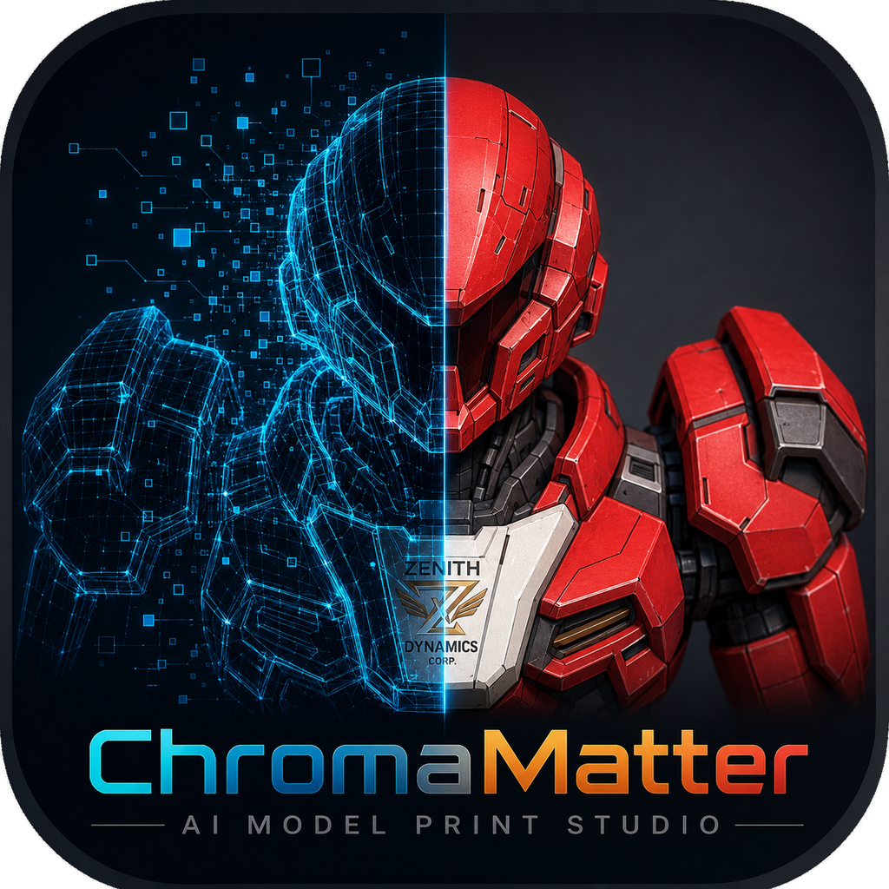

# ChromaMatter — AI Model Print Studio 0.8beta (r32.1 source app)

<p align="center">
  
</p>

[English](README_fixed_en.md)

このdirectoryはChromaMatter — AI Model Print Studioの固定source applicationです。表示versionは`0.8beta`、editionは`AI Model Print Studio r32.1`、artifact revisionは`r32.1-ai-model-print-studio`です。Windows数値versionは`0.8.0.0`のままです。

> **Windows版をダウンロード:** [ChromaMatter 0.8beta r32.1（Windows）](https://github.com/Ponkichi0718/ChromaMatter/releases/download/v0.8beta-r32.1/ChromaMatter-0.8beta-r32.1-win64.zip)
>
> **リリースページ:** [v0.8beta-r32.1](https://github.com/Ponkichi0718/ChromaMatter/releases/tag/v0.8beta-r32.1)
>
> 公開ビルドと完全対応ソースはcommit `b575b93d973ed67e7ada986469b10b4490eef4e5`に固定されています。

> **0.8betaの分割モデル制約:** 同梱の`DemoData/`は成功を確認済みですが、ほかの分割モデルでは閉立体化または3MF出力に失敗する場合があります。すべての入力を安定して修復できる段階ではなく、これが`0.8beta`である理由の一つです。

[画像で見る主な機能と制作フロー](../../FEATURES_JA.md)と、[試作・失敗・実機調整を含む開発記録](https://note.com/ponkichi0718)も参照してください。

## r32.1 release update

r32.1はr32のmodel処理／3MF契約を維持し、公開preview表記を「AIモデル色」へ変更し、権利確認済みのHi3D分割GLBと元画像を`DemoData/`へ同梱します。このdemoではimportしたpart名を信用せずpreviewで対象を確認し、3MF出力前に「黒弱め 5〜25%」presetを必ず適用してください。r32.1 prereleaseは公開済みで、r32はimmutableなprevious evidenceとして保持します。

## r32出力workflow

- 3MF出力時に安全確認済みのpart境界またはGLB同一座標seamを検出した場合、閉立体化を宣言し、成功後だけ出力を再開します。対応する分割GLBは別パーツ同士を溶接せず、結合3MFと個別3MFの両方で厳格検証します。
- Hi3D系の分割データに含まれる識別用`COLOR_0`は、exporter、node、material、texture、既知paletteの証拠がすべて一致した場合だけ除外し、通常の作者指定色は維持します。
- 基本F1～F4を個別変更した後は「現在の4色をプレビュー・3MFへ反映」で右previewと3MF paletteを更新できます。自動提案は既定のままです。
- 3MFは安定したFull Spectrum layer-cycleとprime tower baselineを記録します。実験的なLocal Z、advanced dithering、pointillismはOFF、supportはOrca側で選択します。

## GLB入力 β

- 「OBJ / GLBを開く」は`v x y z r g b`頂点カラーOBJと、埋込baseColor／`COLOR_0`を持つ静的GLBを共通pipelineへ読み込みます。
- GLBのscene／node transformとmesh-node partを保持し、sRGB textureを線形空間で補間・合成して頂点色へ焼き付けます。bundle v2は`source_asset`と`source.glb`を使い、旧OBJ bundle v1も読めます。
- baseColor以外のPBR map、alpha、animation、skin、morph、Draco、meshopt、BasisU、GPU instancing、外部URIは対象外です。texture細部はmesh頂点解像度に制限され、上限は512 MiB／300万頂点／300万三角形です。
- 対応するexploded multipart GLBは元のpart構成を保ってpart単位で正規化します。個別3MF出力ではpart IDと頂点参照を局所番号へ組み直し、不完全または古い対応情報はfail-closedで停止します。

## r30 単一GLBのUV seam閉立体化

- part markerがない単一GLBでも、明示的に「閉立体化」を実行すると、同一点の境界edgeがexact 1:1で逆向きに対応するUV／texture seamかを検証します。
- 証明できたseamだけをcleanup／QEMより前に頂点統合します。面の追加・削除・順番変更とpart ID変更をしないため、manual paintとadaptive treeはordered faceへexact carryされます。
- 蓋を追加する処理ではありません。未対応・同方向・曖昧な境界、非manifold化、本当の穴はfail-closedで停止し、元geometryを維持します。
- 3MFのstrict topology検証は全`type=model` resourceを対象にします。必須検証に合格後、QEM由来の上限内の微小自己交差だけが残る場合はwarningを表示し、Snapmaker Orcaでprojectとして開いたslice preview確認を要求します。

## r30 Manual Editing

- Airbrushの確定待ちguideはscreen-space feedbackです。zoom、pan、orbit、またはprogrammatic camera changeで即時に消し、旧画面座標の軌跡を変換後のviewへ再描画しません。
- view変更後も受付済みcommit tokenと1 stroke = 1 Undoのtransactionはexact frameまで保持します。確定済み3D色だけを新しいviewで描画します。
- batchはcandidate rootだけのeffective-stateを読み、検証済みgeometry配列を再利用します。
- 互換性を確認できる9層Airbrushはadaptive treeを1回だけtraversalし、旧形式、非同心、または非互換geometryは逐次pathへsafe fallbackします。

## 公開UI

- メイン画面は「フィラメント設定」「出力設定」の2ページです。
- ヘッダーは同梱PNGロゴ、`ChromaMatter`、`AI Model Print Studio`をcompactな2段表示にします。
- F1～F4はcompact、mixed paletteはFペアfamily-major順のread-only固定比率swatchです。
- mixed swatch番号はpresentation専用です。canonical state ID、manual paint、project、3MF recipeをrenumberしません。
- calibration chartも同じ表示順とcanonical provenanceを使います。
- 全体共通16／24／32色は既存全パーツへ伝播し、個別編集は対象パーツだけに適用します。
- 「基本4色を初期値へ戻す」buttonは公開UIに表示しません。自動提案と個別編集は維持します。
- 「現在の4色をプレビュー・3MFへ反映」で、個別編集したF1～F4を明示適用します。
- 実機黒補正はmixed palette内に置き、形状再処理は1操作、修復名は「閉立体化」です。

## Portable project folder

標準bundleは次の構成です。

```text
source.obj | source.glb
project.json
prepared_geometry.npz
reference.<ext>  # optional
```

snapshot検証が一致すればprepared geometryとmanual paintをexact restoreします。旧JSONは互換読込できますが、sourceを安全に解決できない場合は元OBJ／GLBを明示選択します。

## フィラメント候補β

- PLA（既定）／ABS β／PETG βを選び、選択素材だけでF1～F4ごとに近い製品を最大3候補まで示します。ΔE00と、実測値かcatalog値かを区別します。
- 自動提案は選択素材内の実在製品を色域バランス済み基準へ対応付けてから4本を選びます。拡張DBのモデル平均色近傍だけが残り、似た茶系4本へ偏る回帰を防ぎます。多色／gradient製品は手動libraryには残し、自動提案からだけ除外します。
- 代表的な赤・黒・灰・茶モデルのsoftware-fit診断では、面積加重`ΔE76 <= 12` coverageが28.63%から98.37%へ改善しました。実機の印刷色を保証する値ではありません。
- 4本は必ず同一素材です。異素材を1つの印刷ジョブへ混在させず、3MFには`Generic PLA`／`Generic ABS`／`Generic PETG`の対応プロファイルを保存します。
- ABSはPLAより登録色・実測・色域が少なく、目的色が無い場合はABS内で近似します。PLAでは補完しません。実機比較チャートで確認し、U1ではTop Coverを使用してください。
- catalogのactive表示は現在の在庫、購入可否、spool lotや実際の造形色を保証しません。
- 手持ち4色の自動構成は`%APPDATA%\TripoSpectrumMapper\owned_filaments.json`から選択素材だけを使う近似探索です。特殊仕上げは実物の小さな混色見本で確認してください。

## 実行

依存関係を用意したPython 3.13環境で実行します。

```powershell
python .\TripoSpectrumMapper_fixed.py
python .\TripoSpectrumMapper_fixed.py --self-test
```

repository rootの`BOOTSTRAP_WINDOWS.ps1`が標準の準備・test入口です。r32.1ではapplication lockが過去のPyPI wheelではなくcontrolled修復wheelを固定するため、`-PyTetWildWheel C:\path\to\pytetwild-0.3.0-cp312-abi3-win_amd64.whl`（または`-PyTetWildWheelhouse`）が必要です。同じ公式releaseの完全対応ソースassetでは`build-evidence/pytetwild/repaired-wheel/`に収録します。`-SkipInstall`は検証済み環境の再テスト専用です。

## r32.1 validation state

- 公開済みr32.1はcommit `b575b93d973ed67e7ada986469b10b4490eef4e5`に固定されています。
- r32.1の集中release test: 113 PASS／0 FAIL。
- r32.1のfull regression: 全1,277件、1,274 PASS／3 optional SKIP／0 FAIL。
- 最終packageと独立したfresh extractの両方で、packaged self-testおよび日英UI smokeがPASS。
- fail-closedなcompliance inventory: 1,455 files（native 256 files）でPASS。
- Windows package: 1,518 files、SHA-256 `1215CF77D8C8CB8AA5CE91DC7C84AE13404F3AA46221321807AD2E8A19F9064A`。
- 完全対応ソースbundle: `release-approved`、既知gapなし、SHA-256 `D5A64F3022265BCE7C5C2DFA0358DFC2C94EEA541A5A4AC5671CE3BA829BE4CC`。
- GitHub Releaseの全6 assetを未認証で独立downloadし、公開sizeとSHA-256がすべて一致。
- source publication eligibility: **true**。上記のexact tagged r32.1 assetに対するbinary publication eligibility: **true**。
- 以下のr32／r31結果は**previous evidence**であり、r32.1を検証しない

- 公開UI非公開化直前のpost-GLB r28候補のprevious evidence: Python `3.13.14`、PyInstaller `6.20.0`、`Ran 992 tests in 87.406s: OK (skipped=1)`、991 PASS／1 optional SKIP
- 同候補の新しいshort pathでのclean one-folder build: PASS
- 同候補のbuilt package self-test: exit 0、`pymeshlab=available`、`glb_import_smoke=true`、全体`ok=true`
- 同候補のbuilt packageの日英UI smoke（隔離profile）: PASS
- 同候補のpublic source／software ZIP restage、fresh extract、manifest／全file hash／CRC／path safety／privacy、Downloads配置、外部`SHA256SUMS`: PASS（source 223／222、software 1404／1403）
- Creator Studio r29 exact sourceの**previous evidence**: Python `3.13.14`、`Ran 998 tests in 83.529s: OK (skipped=1)`、997 PASS／1 optional SKIP
- r29 clean buildのprevious evidence: `C:\OBJAdjR29FIX1`、PyInstaller `6.20.0` one-folder build、packaged `--self-test` exit 0、隔離profile日英UI smoke: PASS
- Creator Studio r30 exact sourceの**previous evidence**: Python `3.13.14`、`Ran 1019 tests in 86.932s: OK (skipped=1)`、1018 PASS／1 optional SKIP。`C:\OBJAdjR30FIX1`でのPyInstaller `6.20.0` clean build、package／stage／archive／privacy／detached `SHA256SUMS-r30.txt`契約: PASS。この証拠はr31へ適用しません。
- ChromaMatter r31 exact sourceのprevious evidence: Python `3.13.14`、`Ran 1024 tests in 100.656s: OK (skipped=1)`、1023 PASS／1 optional SKIP。`C:\OBJAdjR31CM1`でのPyInstaller `6.20.0` clean build、built package self-test、隔離profileの日英UI smoke: PASS。preflight `ChromaMatter.exe`は13,986,866 bytes、FileVersion／ProductVersion `0.8beta`、InternalName `ChromaMatter`、OriginalFilename `ChromaMatter.exe`、SHA-256 `208167A225A37BAAAA473B574B2F746E46427FD0CA63FC5B7201BF3394243743`
- r31 preflight public source: 227 files／226 manifest records、fresh archive exact、privacy technical GO。software: 1,404 files／1,403 manifest records、technical GO。fresh extractのself-test／日英UI smoke: exit 0
- r31 final source-only stage `ChromaMatter_0.8beta-r31-source-public-20260820`: 227 files／226 manifest records、folder／archive parity、CRC、privacy、staged identity／icon／tooling 32 tests、Downloads配置、外部detached `SHA256SUMS-r31.txt`照合: PASS
- Creator Studio r27のprevious evidence: Python `3.13.14`、PyInstaller `6.20`、`Ran 890 tests in 68.257s: OK (skipped=1)`、889 PASS／1 optional SKIP
- preflight clean build、built packageとfresh extract双方のself-test／日英UI smoke: PASS
- preflight EXE: 13,683,090 bytes、version `0.8beta`、SHA-256 `F2AB0AF025430FF3D5587D6C7B2A68365B8C091A7775697A24DDB84DF34EF056`
- preflight public source: 204 files／203 manifest records
- preflight software: 1,340 files／1,339 manifest records
- preflight ZIP、manifest equality、path safety、CRC、privacy: PASS
- r27 previous evidenceのrelease state: `source-published`
- r27 previous evidenceのfinal ZIP SHA-256: `null`
- icon publication rights: `passed-by-creator-declaration`（2026-08-20）。当該asset scopeはproject ownerが公開を承認。独立した法的clearanceではない
- r31 previous evidenceのpublication eligibility: 検証済み`publication_scope=source-only`に限りtrue
- 現行r32.1のsource publication eligibility: exact tagged完全対応ソースassetに対してtrue
- 現行r32.1のbinary publication eligibility: exact tagged Windows assetに対してtrue
- public repository: [https://github.com/Ponkichi0718/ChromaMatter](https://github.com/Ponkichi0718/ChromaMatter)（owner handle `Ponkichi0718`）
- Innovation Fund向け配布package: 公開済み。実機evidenceと提出用presentationは、固定済みr32.1 artifactを変更せず継続改善できます
- physical XP-PEN validation、physical print: pendingの既知制約（source公開blockerではない）

公開済みr32 Releaseと上記r31、r30、r29、r28、r27の結果は各revisionだけの**previous evidence**です。先頭に示したr32.1の検証値とhashは、exact tagged commitと公開assetだけに適用します。2026-08-20のcreator declarationとproject ownerによる公開GOは、ロボットと創作文言`ZENITH DYNAMICS CORP.`を含む変更していないアイコンassetについて保持します。これは独立した商標／意匠clearanceや法的意見ではありません。同梱demoとrelease gateが成功していても、分割モデルの閉立体化は開示済みbeta制約として残ります。

Creator Studio r26の結果も同様にprevious evidenceで、ChromaMatter r31へ流用しません。

## Package identity

- 公開済み完全対応ソース: `ChromaMatter-0.8beta-r32.1-complete-corresponding-source.zip`
- 公開済みWindows package: `ChromaMatter-0.8beta-r32.1-win64.zip`

公開済みdetached checksum fileは`SHA256SUMS-r32.1.txt`です。downloadした全6 Release assetが一致しました。完成済み`SHA256SUMS-r32.txt`と`SHA256SUMS-r31.txt`はprevious evidenceだけに適用します。canonical文書への自己参照ZIP hashは埋め込みません。

## 注意

- OBJは`v x y z r g b`頂点カラーを想定します。
- GLBは静的な埋込baseColor／`COLOR_0`を対象とし、UV detailは頂点色へ焼き付けた解像度になります。
- 大規模OBJ／GLBの準備と200万面級Manual Editingには時間とmemoryが必要です。
- fail-soft importは非2-manifold geometryの自動修復または印刷可能性を保証しません。
- 画面色と実機色は造形条件に依存します。calibration chartとtest printで確認してください。
- 公開成果物へ非公開の検証assetまたは識別可能な詳細を含めません。
- app licenseは`GPL-3.0-or-later`です。依存関係の個別licenseとpublication checklistも確認してください。

正本の状態はrepository rootの`CURRENT_STATE.json`と`PROVENANCE.md`を参照してください。

## AI利用について

企画整理、仕様設計、実装、テスト、文書化、画像制作、GitHub公開作業の各段階でChatGPT／OpenAI CodexなどのAIを活用しています。AI生成のコードや説明には不自然な表現や技術的な誤りが残る可能性があるため、重要な印刷設定はソース、生成3MF、スライサープレビュー、実機で確認してください。最終的な仕様、採否、実機検証、公開判断はプロジェクト作者が行います。
